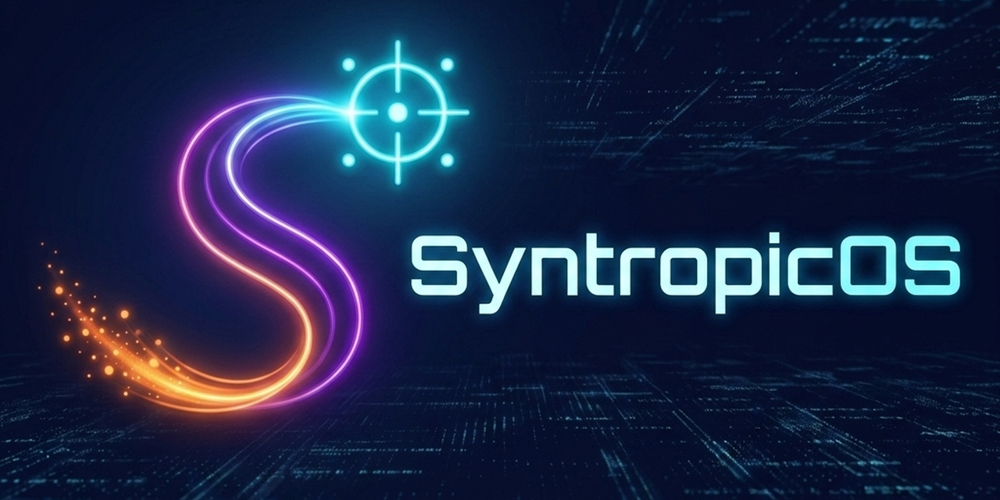
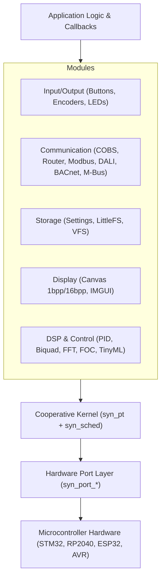

<p align="center">
  
</p>

# SyntropicOS

**High-Performance Bare-Metal Application Framework & Cooperative OS**

[](LICENSE)
[]()
[](https://github.com/outlookhazy/SyntropicOS/actions)

SyntropicOS is a zero-overhead, production-grade C99 framework designed for deeply embedded microcontrollers (STM32, RP2040, ESP32, AVR, RISC-V). It combines stackless coroutines, non-blocking hardware drivers, industrial fieldbuses, fixed-point DSP, and display graphics into a single cooperative ecosystem.

---

## Technical Specifications At-a-Glance

| Property | Design Specification |
|---|---|
| **Concurrency** | Cooperative stackless coroutines (`syn_pt`). Continuation state costs **2 bytes RAM** per thread. |
| **Scheduler** | Cooperative task runner (`syn_sched`). Task descriptors cost **~16–28 bytes RAM** per task. |
| **Memory Allocation** | **100% Zero-Heap / Static Allocation**. No `malloc()` or dynamic pool fragmentation over long runtimes. |
| **Execution Model** | All 70+ drivers & protocol stacks are written as **non-blocking state machines**. |
| **Compatibility** | Standard **C99**. Compiles with GCC, Clang, IAR, Keil, STM32CubeIDE, and Arduino IDE. |

---

## System Architecture

> [!NOTE]
> *If the Mermaid architecture diagram below fails to render on first load, please refresh your browser (GitHub's client-side Mermaid renderer occasionally takes a coffee break).*



---

## Quick Navigation & Documentation Index

- 📖 **[Documentation Hub](https://outlookhazy.github.io/SyntropicOS/)** — Complete online documentation & API reference.
- 🚀 **[Getting Started Guide](https://outlookhazy.github.io/SyntropicOS/getting-started/)** — CMake, Makefile, and C99 bare-metal setup.
- 🛠️ **[IDE Integration Guides](https://outlookhazy.github.io/SyntropicOS/ide-guides/)** — STM32CubeIDE, VS Code, Keil MDK, IAR, and Arduino IDE setup.
- 🔌 **[Arduino Compatibility Guide](https://outlookhazy.github.io/SyntropicOS/arduino/)** — Arduino Library Manager installation & IDE setup.
- 🔧 **[MCU Porting Guide](https://outlookhazy.github.io/SyntropicOS/porting-guide/)** — Implementing custom HAL ports (`syn_port_*`).
- 🧪 **[Testing & Containerization Guide](https://outlookhazy.github.io/SyntropicOS/testing/)** — Unity unit tests, QEMU emulation, sanitizers, and integration daemons.


### Module Guides
- ⚡ **[Core & Multitasking](https://outlookhazy.github.io/SyntropicOS/modules/multitasking/)** — Protothreads, Task Scheduler, Active Objects, Workqueues.
- 🎛️ **[Input / Output](https://outlookhazy.github.io/SyntropicOS/modules/io/)** — Debounced Buttons, Tap Gestures, Combos, Rotary Encoders, LEDs, Soft PWM.
- 📡 **[Communication Protocols](https://outlookhazy.github.io/SyntropicOS/modules/communication/)** — COBS Framing, Addressed Router, Modbus RTU/TCP, DALI, BACnet MS/TP, M-Bus, ISO-TP, J1939, NMEA 2000, CCP v2.1, ASAM XCP v1.x, UDS (ISO 14229), ODVA DeviceNet.
- 💾 **[Storage & Filesystems](https://outlookhazy.github.io/SyntropicOS/modules/storage/)** — Persistent Settings Manager, Wear-Leveled Flash, LittleFS, FAT.
- 🖥️ **[Display & Embedded UI](https://outlookhazy.github.io/SyntropicOS/modules/display/)** — Framebuffer Canvas, 2D Graphics, Zero-Heap IMGUI.
- 🔬 **[Diagnostics & Debug](https://outlookhazy.github.io/SyntropicOS/modules/debug/)** — Lightweight Event Tracer (`syn_trace`), Task CPU Profiler (`syn_profiler`), Serial CLI.


---

## Minimal Example

```c
#include "syntropic/syntropic.h"

#define LED_PIN 13

static SYN_PT_Status blink_task(SYN_PT *pt, SYN_Task *task) {
    PT_BEGIN(pt);
    for (;;) {
        syn_gpio_toggle(LED_PIN);
        PT_TASK_DELAY_MS(pt, task, 500); // Non-blocking 500ms delay
    }
    PT_END(pt);
}

int main(void) {
    syn_gpio_init(LED_PIN, SYN_GPIO_OUTPUT);
    
    static SYN_Task tasks[1];
    static SYN_Sched sched;
    
    syn_task_create(&tasks[0], "blink", blink_task, 0, NULL);
    syn_sched_init(&sched, tasks, 1);
    syn_sched_run_forever(&sched);
}
```

---

## Example Projects Directory ([`examples/`](examples/))

SyntropicOS includes over 50 complete hardware and SDK examples across bare-metal C, STM32 HAL, PlatformIO, and Arduino. See **[`examples/README.md`](examples/README.md)** for the full categorized directory.

### Featured Example Highlights
- **Industrial Automation**: **[`examples/stm32_modbus_tcp`](examples/stm32_modbus_tcp)** — Dual Modbus TCP Server (port 502) & Client running in a single project.
- **Motion Control & EtherCAT**: **[`examples/stm32_ethercat_servo`](examples/stm32_ethercat_servo)** — EtherCAT Slave node & CiA 402 drive control.
- **Automotive Fieldbus**: **[`examples/stm32_canopen`](examples/stm32_canopen)** — CANopen (CiA 301) SDO/PDO dictionary node.
- **Smart Energy**: **[`examples/stm32_mbus_meter`](examples/stm32_mbus_meter)** — M-Bus (EN 13757) utility meter reader.
- **Power Management**: **[`examples/stm32_pmbus_power`](examples/stm32_pmbus_power)** — PMBus 1.2/1.3 digital power telemetry & Linear11/16 decoder.
- **Embedded Shell & UI**: **[`examples/stm32_cli_shell`](examples/stm32_cli_shell)** — Interactive USART CLI shell (`led`, `status`, `temp`).
- **Rotary Input & Debounce**: **[`examples/stm32_encoder_button`](examples/stm32_encoder_button)** — EC11 rotary encoder & push-button gesture controller.
- **Closed-Loop Control**: **[`examples/PID_TempControl`](examples/PID_TempControl)** — Non-blocking integer PID temperature controller.

👉 *Explore all 50+ example projects in the **[Examples Directory](examples/README.md)**.*


---

## Containerized Verification Workflow

```bash
make test         # Run Unity unit test suite (1200+ unit tests passing)
make san          # Execute AddressSanitizer & UBSan memory safety audit
make qemu         # Bare-metal ARM Cortex-M4 boot emulation
make fuzz         # Run LLVM libFuzzer protocol targets (COBS, Modbus, MQTT, HTTP)
make cov          # Generates LCOV HTML code coverage reports
make static       # Run Cppcheck and Clang scan-build static analysis
make dox          # Build Doxygen API documentation (0 warnings tolerance)
make integration  # Run E2E tests against 8 genuine production container daemons
```
