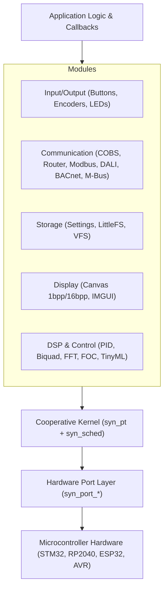

<p align="center">
  
</p>

# SyntropicOS

**High-Performance Bare-Metal Application Framework & Cooperative OS**

[](LICENSE)
[]()
[](https://github.com/outlookhazy/SyntropicOS/actions)

SyntropicOS is a zero-overhead, production-grade C99 framework designed for deeply embedded microcontrollers (STM32, RP2040, ESP32, AVR, RISC-V). It combines stackless coroutines, non-blocking hardware drivers, industrial fieldbuses, fixed-point DSP, and display graphics into a single cooperative ecosystem.

---

## Technical Specifications At-a-Glance

| Property | Design Specification |
|---|---|
| **Concurrency** | Cooperative stackless coroutines (`syn_pt`). Continuation state costs **2 bytes RAM** per thread. |
| **Scheduler** | Cooperative task runner (`syn_sched`). Task descriptors cost **~16–28 bytes RAM** per task. |
| **Memory Allocation** | **100% Zero-Heap / Static Allocation**. No `malloc()` or dynamic pool fragmentation over long runtimes. |
| **Execution Model** | All 70+ drivers & protocol stacks are written as **non-blocking state machines**. |
| **Compatibility** | Standard **C99**. Compiles with GCC, Clang, IAR, Keil, STM32CubeIDE, and Arduino IDE. |

---

## System Architecture



---

## Quick Navigation & Documentation Index

- 📖 **[Documentation Hub](docs/index.md)** — Complete repository documentation index.
- 🚀 **[Getting Started Guide](docs/getting-started.md)** — CMake, Makefile, and C99 bare-metal setup.
- 🔌 **[Arduino Compatibility Guide](docs/arduino.md)** — Arduino Library Manager installation & IDE setup.
- 🔧 **[MCU Porting Guide](docs/porting-guide.md)** — Implementing custom HAL ports (`syn_port_*`).
- 🧪 **[Testing & Containerization Guide](docs/testing.md)** — Unity unit tests, QEMU emulation, sanitizers, and integration daemons.

### Module Guides
- ⚡ **[Core & Multitasking](docs/modules/multitasking.md)** — Protothreads, Task Scheduler, Active Objects, Workqueues.
- 🎛️ **[Input / Output](docs/modules/io.md)** — Debounced Buttons, Tap Gestures, Combos, Rotary Encoders, LEDs, Soft PWM.
- 📡 **[Communication Protocols](docs/modules/communication.md)** — COBS Framing, Addressed Router, Modbus RTU/TCP, DALI, BACnet MS/TP, M-Bus, ISO-TP, J1939, NMEA 2000.
- 💾 **[Storage & Filesystems](docs/modules/storage.md)** — Persistent Settings Manager, Wear-Leveled Flash, LittleFS, FAT.
- 🖥️ **[Display & Embedded UI](docs/modules/display.md)** — Framebuffer Canvas, 2D Graphics, Zero-Heap IMGUI.
- 🔬 **[Diagnostics & Debug](docs/modules/debug.md)** — Lightweight Event Tracer (`syn_trace`), Task CPU Profiler (`syn_profiler`), Serial CLI.

---

## Minimal Example

```c
#include "syntropic/syntropic.h"

#define LED_PIN 13

static SYN_PT_Status blink_task(SYN_PT *pt, SYN_Task *task) {
    PT_BEGIN(pt);
    for (;;) {
        syn_gpio_toggle(LED_PIN);
        PT_TASK_DELAY_MS(pt, task, 500); // Non-blocking 500ms delay
    }
    PT_END(pt);
}

int main(void) {
    syn_gpio_init(LED_PIN, SYN_GPIO_OUTPUT);
    
    static SYN_Task tasks[1];
    static SYN_Sched sched;
    
    syn_task_create(&tasks[0], "blink", blink_task, 0, NULL);
    syn_sched_init(&sched, tasks, 1);
    syn_sched_run_forever(&sched);
}
```

---

## Example Projects Directory ([`examples/`](examples/))

SyntropicOS ships with hardware and SDK examples across bare-metal C, STM32 HAL, PlatformIO, and Arduino:

- **[`examples/stm32_bacnet_mstp`](examples/stm32_bacnet_mstp)** — STM32 RS485 BACnet MS/TP Smart Thermostat / Sensor node.
- **[`examples/stm32_lin_bus`](examples/stm32_lin_bus)** — STM32 HAL LIN 2.1 automotive bus Master schedule table & Slave response node.
- **[`examples/stm32_mbus_meter`](examples/stm32_mbus_meter)** — STM32 HAL M-Bus (Meter-Bus EN 13757) utility meter reader.
- **[`examples/stm32_modbus_master`](examples/stm32_modbus_master)** — STM32 RS485 Modbus RTU Master querying slave registers.


- **[`examples/stm32_dali_lighting`](examples/stm32_dali_lighting)** — STM32 DALI (IEC 62386) LED Dimmer / Control Gear node.
- **[`examples/stm32_crypto_usart`](examples/stm32_crypto_usart)** — STM32 USART receiver with SHA-256 digest & AES-128 encryption.
- **[`examples/stm32_spsc_usart`](examples/stm32_spsc_usart)** — STM32 USART RX interrupt ingestion using `syn_spsc_queue`.
- **[`examples/stm32_ringbuf_usart`](examples/stm32_ringbuf_usart)** — STM32 USART RX interrupt ring buffer processing.
- **[`examples/stm32_uart_mcu_comm`](examples/stm32_uart_mcu_comm)** — STM32 HAL single-byte UART interrupt Master/Slave packet router.

- **[`examples/ButtonEvents`](examples/ButtonEvents)** — Multi-click tap gestures, long-press, and chorded button combos.
- **[`examples/SensorLogger`](examples/SensorLogger)** — Dual-channel ADC sampling, EMA filtering, and Serial CLI.
- **[`examples/MotorFSM`](examples/MotorFSM)** — Finite state machine controlling a DC motor ramp profile.
- **[`examples/PID_TempControl`](examples/PID_TempControl)** — Closed-loop integer PID temperature controller.

---

## Containerized Verification Workflow

```bash
make test         # Run Unity unit test suite (1200+ unit tests passing)
make san          # Execute AddressSanitizer & UBSan memory safety audit
make qemu         # Bare-metal ARM Cortex-M4 boot emulation
make fuzz         # Run LLVM libFuzzer protocol targets (COBS, Modbus, MQTT, HTTP)
make cov          # Generates LCOV HTML code coverage reports
make static       # Run Cppcheck and Clang scan-build static analysis
make dox          # Build Doxygen API documentation (0 warnings tolerance)
make integration  # Run E2E tests against 8 genuine production container daemons
```
