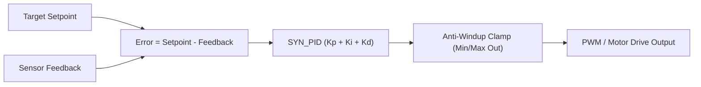

# Control & Motor Modules

SyntropicOS provides integer-only control algorithms, closed-loop PID controllers, trapezoidal motion profiling, and Field-Oriented Control (FOC) for BLDC/PMSM motors.

---

## Technical Specifications

| Feature | Specification |
|---|---|
| **Math Format** | Fixed-point Q16.16 (`q16_t`) or normalized integer scaling. |
| **FPU Requirement** | **None**. Runs on ARM Cortex-M0/M3/M4, RISC-V, and 8-bit MCUs. |
| **Safety Features** | Anti-windup clamping, derivative filtering, stall detection, & limit events. |

---

## 1. Closed-Loop PID Controller (`control/syn_pid.h`)

The `syn_pid` module provides an integer-only PID controller with anti-windup clamping and derivative-term filtering.

### Control Loop Diagram



### Complete Code Example (Integer PID Temperature / Speed Control)

```c
#include <syntropic/control/syn_pid.h>

static SYN_PID pid;

void control_init(void) {
    // Configure PID gains: Kp = 2.5, Ki = 0.5, Kd = 0.1, Output Range: 0 to 100% PWM
    SYN_PID_Config cfg = {
        .Kp = Q16_FROM_FLOAT(2.5f),
        .Ki = Q16_FROM_FLOAT(0.5f),
        .Kd = Q16_FROM_FLOAT(0.1f),
        .out_min = 0,
        .out_max = 1000, // 0 to 100.0% PWM
        .integral_min = -500,
        .integral_max = 500
    };
    syn_pid_init(&pid, &cfg);
}

uint16_t control_step(int32_t setpoint, int32_t current_reading) {
    // Compute control output step
    int32_t output = syn_pid_update(&pid, setpoint, current_reading);
    return (uint16_t)output;
}
```

---

## 2. Stepper Motor Control (`motor/syn_stepper.h`)

Provides Step/Direction motor driving with trapezoidal velocity acceleration profiles.

```c
#include <syntropic/motor/syn_stepper.h>

static SYN_Stepper stepper;

void stepper_init(void) {
    // Initialize pin 4 (step), pin 5 (dir), max_speed = 1000 steps/s, accel = 500 steps/s²
    syn_stepper_init(&stepper, 4, 5, 1000, 500);
}

void move_relative(int32_t steps) {
    syn_stepper_move(&stepper, steps);
}

void main_timer_isr(void) {
    // Serves step generation (call at fixed interrupt interval e.g. 10 kHz)
    syn_stepper_update(&stepper);
}
```

---

## 3. Field-Oriented Control (FOC) (`motor/syn_foc.h`)

Provides Clarke/Park transforms, Space Vector PWM (SVPWM), and Sliding Mode Observers (SMO) for sensorless BLDC/PMSM motor control in pure Q16.16 fixed-point math.

```c
#include <syntropic/motor/syn_foc.h>
#include <syntropic/motor/syn_foc_observer.h>

static SYN_FOCObserver observer;

void foc_setup(void) {
    SYN_FOCObserverConfig cfg = {
        .R = Q16_FROM_FLOAT(0.5f),    // 0.5 Ohm phase resistance
        .L = Q16_FROM_FLOAT(0.001f),  // 1 mH phase inductance
        .G = Q16_FROM_INT(10),        // Sliding mode observer gain
        .dt = Q16_FROM_FLOAT(0.0001f),// 10 kHz sampling period (100 µs)
        .Kp_pll = Q16_FROM_INT(150),
        .Ki_pll = Q16_FROM_INT(6000)
    };
    syn_foc_observer_init(&observer, &cfg);
}

void foc_10khz_isr(q16_t v_alpha, q16_t v_beta, q16_t i_alpha, q16_t i_beta) {
    // 1. Update Sliding Mode Observer with phase voltages and currents
    syn_foc_observer_update(&observer, v_alpha, v_beta, i_alpha, i_beta);

    // 2. Read estimated rotor angle theta_e [0, 2pi) and speed omega_e
    q16_t est_angle = syn_foc_observer_get_angle(&observer);
    q16_t est_speed = syn_foc_observer_get_speed(&observer);
}
```
