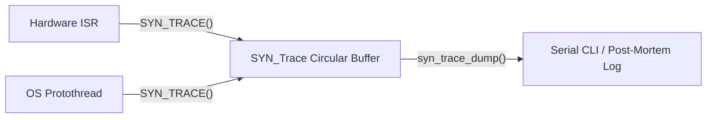

# Debug & Diagnostic Modules

SyntropicOS includes lightweight, zero-overhead diagnostic tools designed specifically for constrained embedded systems. They operate without dynamic memory allocations (`malloc`), long string formatting overhead, or blocking UART prints.

---

## 1. Lightweight Event Tracer (`syn_trace.h`)

The `syn_trace` module is a high-speed, timestamped circular event recorder. It allows ISRs and tasks to record events in real-time with microsecond timestamps without delaying time-critical execution.

### Features
- Fixed-size caller-owned circular buffer (`SYN_TraceEntry`).
- Safe to record inside Interrupt Service Routines (ISRs).
- Zero string formatting during record time.
- Post-mortem dump over Serial CLI or GDB debugger.

### Architecture Flow



### Complete Code Example

```c
#include <syntropic/debug/syn_trace.h>

#define EVT_SYSTEM_START    0x0001
#define EVT_SENSOR_READ     0x0002
#define EVT_PACKET_RX       0x0003
#define EVT_ERROR_OVERFLOW  0x00E0

static SYN_TraceEntry trace_buffer[64];
static SYN_Trace trace;

void debug_print(const char *msg) {
    printf("%s", msg);
}

void app_init(void) {
    // Initialize circular buffer with 64 entries
    syn_trace_init(&trace, trace_buffer, 64);

    // Record system startup event
    SYN_TRACE(&trace, EVT_SYSTEM_START, 0);
}

void on_uart_packet_received(uint16_t length) {
    // Record event ID + length payload in < 1µs
    SYN_TRACE(&trace, EVT_PACKET_RX, length);
}

void dump_trace_log(void) {
    // Dump formatted event history over serial
    syn_trace_dump(&trace, debug_print);
}
```

---

## 2. Task CPU Profiler (`syn_profiler.h`)

The `syn_profiler` module hooks directly into the cooperative scheduler (`syn_sched`) to measure CPU usage per task, peak single-run execution times, and task execution counts.

### Features
- Measures task execution time in microseconds (`µs`).
- Calculates CPU percentage with 0.1% resolution (`cpu_percent_x10`).
- Tracks peak run time (`peak_us`) to identify task latency spikes.
- Periodically outputs formatted diagnostic tables over CLI.

### Complete Code Example

```c
#include <syntropic/debug/syn_profiler.h>

static SYN_ProfileEntry prof_entries[3];
static SYN_Profiler profiler;

void cli_print_line(const char *line) {
    printf("%s", line);
}

void app_setup_profiler(void) {
    // Initialize profiler for 3 tasks over a 1000ms evaluation window
    syn_profiler_init(&profiler, prof_entries, 3, 1000);
    
    syn_profiler_set_name(&profiler, 0, "SensorTask");
    syn_profiler_set_name(&profiler, 1, "CommTask");
    syn_profiler_set_name(&profiler, 2, "DisplayTask");
}

void scheduler_loop(void) {
    uint32_t now = syn_port_get_tick_ms();

    // 1. Profile Task 0 (SensorTask)
    syn_profiler_task_begin(&profiler, 0);
    run_sensor_task();
    syn_profiler_task_end(&profiler, 0);

    // 2. Profile Task 1 (CommTask)
    syn_profiler_task_begin(&profiler, 1);
    run_comm_task();
    syn_profiler_task_end(&profiler, 1);

    // 3. Periodically evaluate & dump CPU profiling stats (every 1 second)
    if (syn_profiler_update(&profiler)) {
        syn_profiler_dump(&profiler, cli_print_line);
    }
}
```

### Sample Profiler Output
```text
--- CPU Profiler (Period: 1000 ms) ---
Task            CPU %      Peak (us)   Runs
--------------------------------------------
SensorTask      12.5%        1420 us    100
CommTask         4.2%         320 us     50
DisplayTask     28.1%        4800 us     10
```
