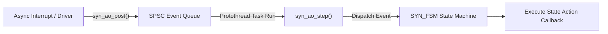

# Cross-Module System Integration

SyntropicOS modules are architected to seamlessly compose with each other. When multiple modules are enabled in `syn_config.h`, cross-module integrations automatically hook together without requiring verbose glue code.

---

## Automatic Integration Matrix

| Source Module | Target Module | Automatic Integration Behavior |
|---|---|---|
| **Active Object** | **FSM** | Combines Table-Driven FSM state machine + thread-safe event queue + protothread task runner into an event-driven actor. |
| **Button** | **FSM** | Leverages `syn_fsm` state machine internally for debouncing, long-press hold transitions, and combo tracking. |
| **Watchdog** | **Error Log** | Task execution timeout and deadlock events are automatically recorded into `syn_errlog` when `.errlog` is configured. |
| **CLI** | **Scheduler** | Built-in CLI command `tasks` automatically displays task states, priorities, and run statistics when `syn_cli_set_scheduler()` is invoked. |
| **CLI** | **Error Log** | Built-in CLI command `errors` dumps circular error log history over serial when `syn_cli_set_errlog()` is invoked. |
| **CLI** | **Version** | Built-in CLI command `version` automatically reports SyntropicOS kernel version, target architecture, and build timestamps. |
| **Param Store** | **CRC-16** | Uses `syn_crc16_ccitt()` for flash payload validation and corruption detection. |
| **Modbus** | **CRC-16** | Uses `syn_crc16_modbus()` for RTU frame validation. |

---

## 1. CLI + Scheduler & Error Log Integration

Attaching the scheduler and error logger to the Serial CLI exposes instant runtime diagnostics over UART without writing custom CLI commands:

```c
#include <syntropic/cli/syn_cli.h>
#include <syntropic/sched/syn_sched.h>

static SYN_CLI cli;
static SYN_Sched sched;

void app_setup_diagnostics(void) {
    // 1. Initialize CLI & Scheduler...
    
    // 2. Attach scheduler to CLI: automatically registers the 'tasks' command!
    syn_cli_set_scheduler(&cli, &sched);
}
```

### CLI Terminal Output (`> tasks`)
```text
> tasks
--- Active Tasks ---
ID  Name        State    Priority   Delay(ms)
---------------------------------------------
0   sys_bg      RUNNING  0          10
1   sensor      YIELD    1          200
2   display     WAITING  2          50
```

---

## 2. Active Object Pattern (`syn_ao` + `syn_fsm`)

The **Active Object (AO)** integration combines three core primitives:
1. **FSM State Machine** (`syn_fsm`): Manages state transitions.
2. **SPSC Event Queue** (`syn_spsc_queue`): Buffers incoming asynchronous events.
3. **Protothread Task** (`syn_pt`): Executes event dispatching inside the cooperative scheduler.

### Active Object Flow


