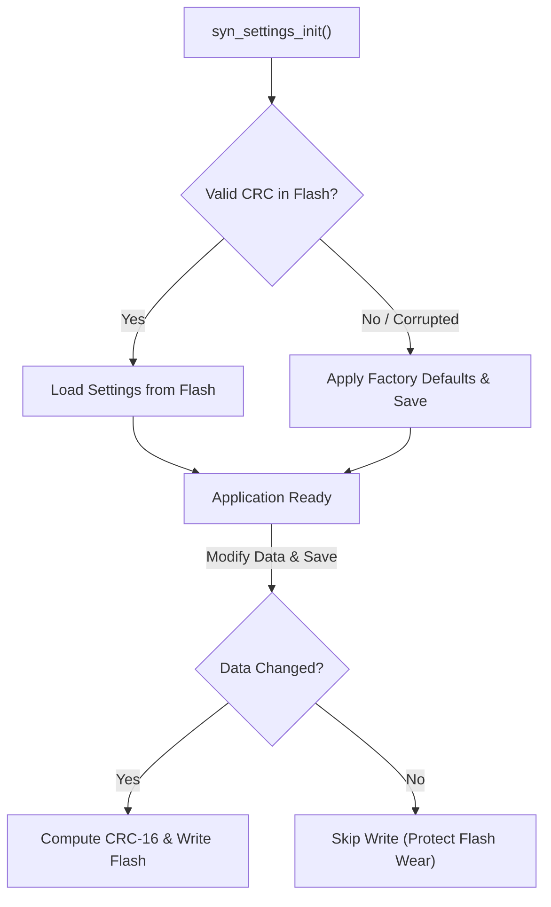

# Storage & Non-Volatile Memory Modules

SyntropicOS provides persistent storage components scaling from wear-leveled flash parameters to virtual filesystem abstractions supporting LittleFS and FAT.

---

## 1. Persistent Settings Manager (`syn_settings.h`)

The `syn_settings` module simplifies non-volatile configuration management. It wraps `syn_param` to provide:
- **Load-or-Default Initialization**: Loads saved configuration from flash on startup, automatically applying factory default values if flash is uninitialized or corrupted.
- **CRC-16 Checksum Validation**: Automatically tracks data integrity and detects changes.
- **Wear-Leveling Protection**: Prevents unnecessary flash erase cycles by only writing when data actually changes.
- **Change Callbacks**: Triggers application callbacks when settings are updated.

### Storage Pipeline Flow



### Complete Code Example

```c
#include <syntropic/storage/syn_settings.h>

// Define custom application configuration struct
typedef struct {
    uint32_t baud_rate;
    uint16_t node_id;
    uint8_t  display_brightness;
} SystemConfig;

// Factory default values
static const SystemConfig default_config = {
    .baud_rate = 115200,
    .node_id = 0x01,
    .display_brightness = 80
};

static SystemConfig active_config;
static SYN_Settings settings_store;

void on_config_changed(SYN_Settings *store, void *ctx) {
    printf("Config updated! New Node ID: 0x%02X\n", active_config.node_id);
}

void app_init(void) {
    // Flash sector base address = 0x080E0000, Sector Copies = 2 (ping-pong wear leveling)
    syn_settings_init(&settings_store, 0x080E0000, 2,
                      &active_config, sizeof(active_config), &default_config);

    // Register callback for when settings change
    syn_settings_on_change(&settings_store, on_config_changed, NULL);

    printf("Active Baud Rate: %lu\n", (unsigned long)active_config.baud_rate);
}

void update_node_id(uint16_t new_id) {
    active_config.node_id = new_id;
    
    // Computes CRC-16 and writes flash ONLY if node_id actually changed
    syn_settings_save(&settings_store);
}
```

---

## 2. Virtual File System (`syn_vfs.h`)

SyntropicOS provides a unified Virtual File System (VFS) interface to abstract raw storage media (Internal Flash, SPI NOR Flash, SD Cards).

### Features
- Standardized POSIX-like API (`syn_vfs_open`, `syn_vfs_read`, `syn_vfs_write`, `syn_vfs_close`).
- Mount points for LittleFS (`syn_lfs`) and FAT (`syn_fat`).

### Supported Filesystems

| Module | Header | Ideal Use Case |
|---|---|---|
| **LittleFS** | `storage/syn_lfs.h` | NOR Flash memory, power-fail safe, wear-leveled |
| **FAT / FAT32** | `storage/syn_fat.h` | SD Cards, USB Mass Storage, PC-readable drives |
| **Param Store** | `storage/syn_param.h` | Sector-based raw parameter storage without a filesystem |
