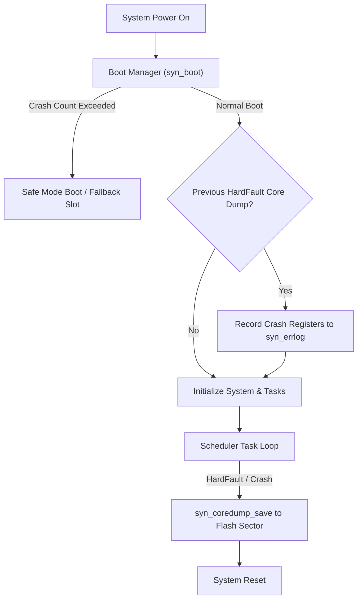

# System Architecture & Recovery Modules

SyntropicOS provides production-grade system resilience services, including crash-loop boot management, fault-recording core dumps, transport-agnostic OTA firmware updates, and persistent error registries.

---

## Architecture Resilience Map



---

## 1. Boot Manager & Safe-Mode (`system/syn_boot.h`)

The `syn_boot` module tracks continuous boot cycles and crash loops. If the system crashes repeatedly within a short window after power-on, the boot manager automatically enters **Safe Mode** to allow firmware recovery.

### Features
- Configurable crash window (`SYN_BOOT_CRASH_WINDOW_MS`) and max retry threshold.
- Automatic event logging to `syn_errlog`.
- Safe mode fallback flag query (`syn_boot_is_safe_mode()`).

### Code Example

```c
#include <syntropic/system/syn_boot.h>

static SYN_Boot boot;

void app_boot_check(void) {
    // Sector base = 0x08030000, max crash retries = 3, crash window = 5000ms
    syn_boot_init(&boot, 0x08030000, 3, 5000);

    if (syn_boot_is_safe_mode(&boot)) {
        printf("WARNING: Crash loop detected! Booting into SAFE MODE...\n");
        // Start minimal recovery task (e.g., Serial CLI or OTA UART update)
    } else {
        printf("Normal boot sequence proceeding.\n");
    }
}

void app_main_ready(void) {
    // Call once system initialization successfully completes
    syn_boot_confirm_successful(&boot);
}
```

---

## 2. Core Dump & Hardware Fault Recovery (`system/syn_coredump.h` & `system/syn_fault.h`)

When a hardware fault (e.g. ARM Cortex-M HardFault, BusFault, or Memory Management Fault) occurs, `syn_coredump` captures the CPU registers (`PC`, `LR`, `SP`, `PSR`) and a stack snapshot, persisting them to flash before resetting.

### Features
- Zero-heap register and stack capture inside fault ISR handler.
- Reads back register snapshot on next boot for post-mortem diagnostics.

### Code Example

```c
#include <syntropic/system/syn_coredump.h>
#include <syntropic/system/syn_fault.h>

void check_previous_crash(void) {
    SYN_CoreDump dump;
    
    // Read and verify previous crash dump from flash
    if (syn_coredump_read(&dump)) {
        printf("CRASH DETECTED on last boot!\n");
        printf("  Fault PC:  0x%08X\n", (unsigned int)dump.regs.pc);
        printf("  Fault LR:  0x%08X\n", (unsigned int)dump.regs.lr);
        printf("  Uptime:    %lu ms\n", (unsigned long)dump.uptime_ms);
        
        // Clear core dump after reading
        syn_coredump_clear();
    }
}

// In MCU HardFault Interrupt Handler
void HardFault_Handler(void) {
    SYN_FaultContext ctx;
    syn_fault_capture(&ctx);
    syn_coredump_save(&ctx);
    
    syn_port_system_reset();
}
```

---

## 3. Persistent Error Log (`system/syn_errlog.h`)

The `syn_errlog` module maintains a wear-leveled, persistent circular error log storing error severity, subsystem ID, timestamp, and context codes.

```c
#include <syntropic/system/syn_errlog.h>

static SYN_ErrLog errlog;
static SYN_ErrLogEntry log_buffer[16];

void app_setup_errlog(void) {
    syn_errlog_init(&errlog, log_buffer, 16);
    
    // Log an error event
    syn_errlog_record(&errlog, SYN_LOG_ERROR, SUB_SYS_COMM, ERR_TIMEOUT, 0x0042);
}
```

---

## 4. Transport-Agnostic Firmware Update (`system/syn_fwupdate.h`)

Provides streaming, block-by-block OTA firmware image flashing with optional **HMAC-SHA256 signature verification**.

```c
#include <syntropic/system/syn_fwupdate.h>

static SYN_FWUpdate fw;

void on_ota_chunk_received(const uint8_t *chunk, size_t len) {
    // Stream incoming firmware chunks over UART, Wi-Fi, BLE, or CAN
    syn_fwupdate_write(&fw, chunk, len);
}
```
